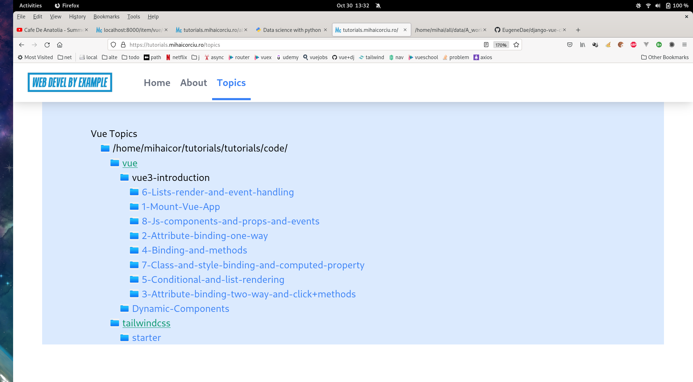

# Django/Tailwind/Prism blog which displays a folder structure with classified micro web projects examples

File classification are made with json files:

- Category directory had a category.json file

`{ "name" : "TailwindCss" }`

- Topic directory had a topic.json file which define meta tags and the files which will be displayed in the topic:

`{
  "title": "Components / props / events",
  "tags": ["vue","components","props","events"],
  "files": ["index.html","main.js","components/ItemDetails.js","components/ItemDisplay.js"]	  
}
`

Folder/files tree structure are stored in "code" folder.
"Code" folder is at the same level as project folder.
